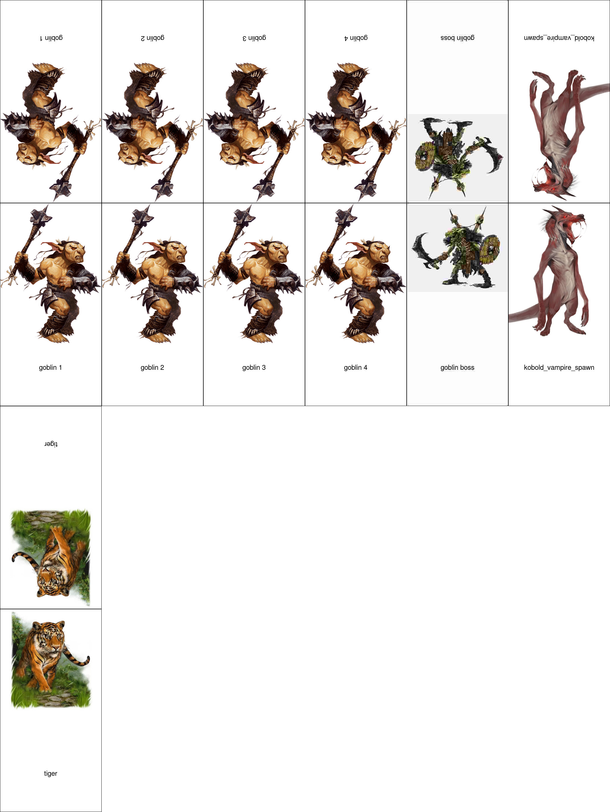

## What

Creates Pathfinder-style paper pawns for dnd from input images. Assumes 9:16 proportions.

## Usage

Move script into folder and run it.

## Todo

- Add support for bigger monsters

## Acknowledgements

All images in example (c) WoTC
